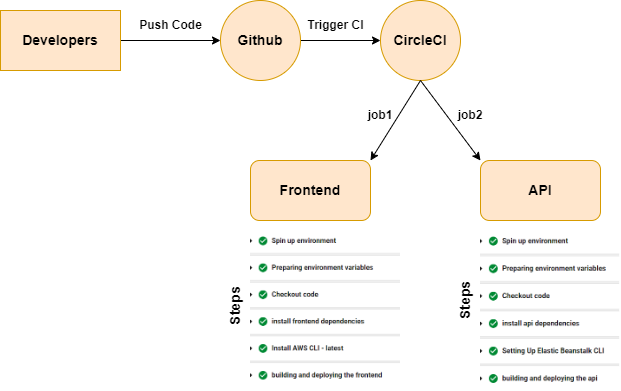

# Pipeline Process



* Orbs: 
```
  node: circleci/node@4.2.0
  aws-cli: circleci/aws-cli@2.0.0
  aws-elastic-beanstalk: circleci/aws-elastic-beanstalk@2.0.1
```

* Jobs(two main jobs) :
    * frontend 
    * api

* Frontend steps:
    1. Spin Up Environment
    2. Preparing Environment Variables
    3. Checkout
    4. Install dependencies
    5. Install aws cli
    6. Building and Deploying 

* API steps:
    1. Spin Up Environment
    2. Preparing Environment Variables
    3. Checkout
    4. Install dependencies
    5. Setting up Elastic Beanstalk cli
    6. Building and Deploying 


* Workflow: 
    1. frontend job
    2. api job
